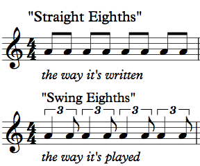

# Exercise 2 – Rhythm and Timing

## Research Question:
---
> Do jazz musicians display evidence of unique, personal timing patterns in their sense of 'swing' rhythm?

The concept of a 'swung' rhythm is common in jazz. Typically, it refers to the durational elongation of the first of a series of two quavers, followed by an equivalent shortening of the second quaver. Some forms of musical transcription notate swing as a triplet crotchet followed by a triplet quaver; in actual performances, however, the exact duration of the two notes is rarely so obvious.

The amount of 'swing' a player uses has often been cited as a key aspect of their musical personality. But how unique is the sense of swing for a particular musician? In an attempt to explore this issue, we will be using [Sonic Visualiser](https://www.sonicvisualiser.org/) to create a timing profile for an improvised performance by one musician. We will compare this profile to a series of similar timing profiles generated in a paper by Fernando Benadon.