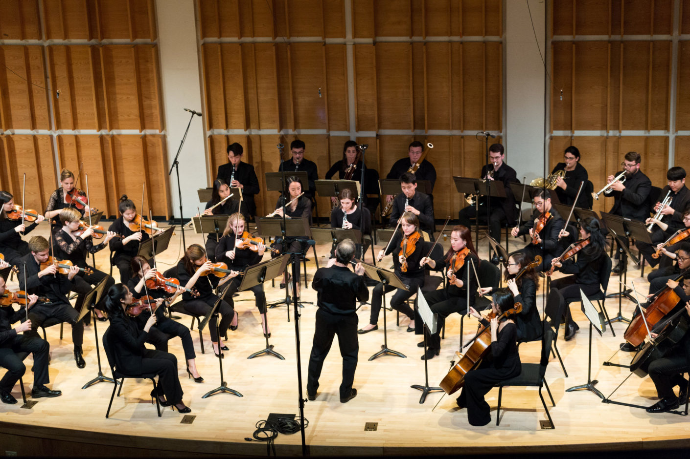

# Exercise 3 – Tempo and Speed

## Research Question:
---
> How has the tempo of performances of a canonical orchestral work changed over time? 

As far back as the early 1900s, scholars have noticed substantial differences in the tempo of different performances of the same work. This has been particularly apparent in orchestral music, where tempo and speed exists as a key expressive tool for the conductor to utilise, and may also reflect wider trends in musical thought and performance practice held at the time. Performance scientist José A. Bowen, for instance, demonstrated in 1999 how different philosophical and analytical approaches to the music of Beethoven before and after World War II led to radical differences in the interpretation of the tempo of his music in performance.

Taking Bowen's methodology as a starting point, we are going to investigate a recording of the same Beethoven work made after the publication of his paper and examine whether his conclusions still remain valid twenty years later. To do so, we will be utilising [Sonic Visualiser](https://www.sonicvisualiser.org/) to create timing profiles for the same section of the music that Bowen himself studied.

:::{note}
You might wonder why I have chosen to seperate studies of rhythm and timing from studies of tempo and speed. While both tend to have a similar methodological approach (measuring timing onsets), the difference is in the units of measurement; rhythmic studies, such as the one outlined in Exercise 2, are generally concerned with note-to-note timings, while tempo studies usually involve timing whole bars or sections.
:::

